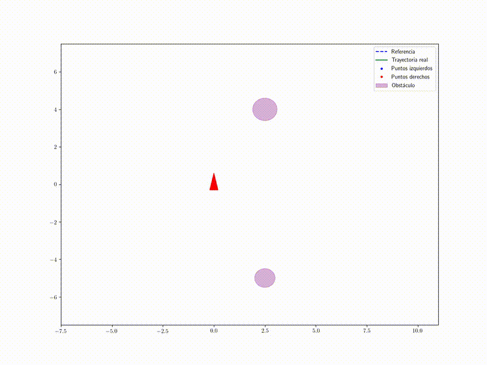
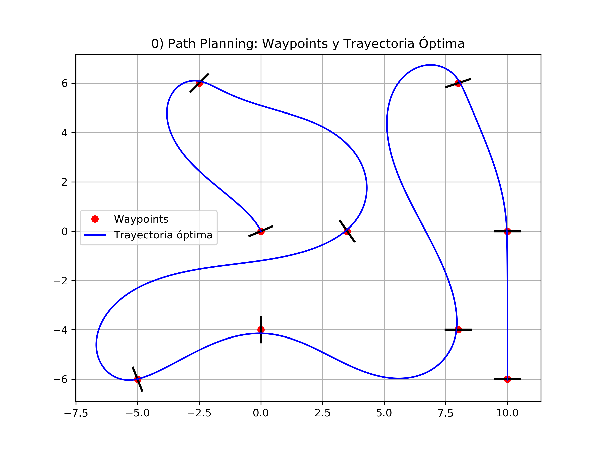
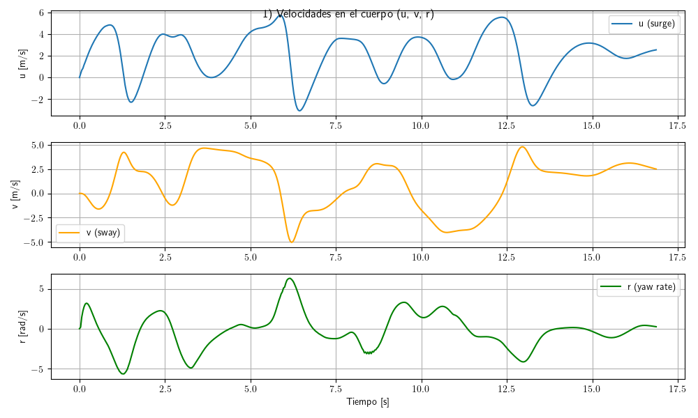
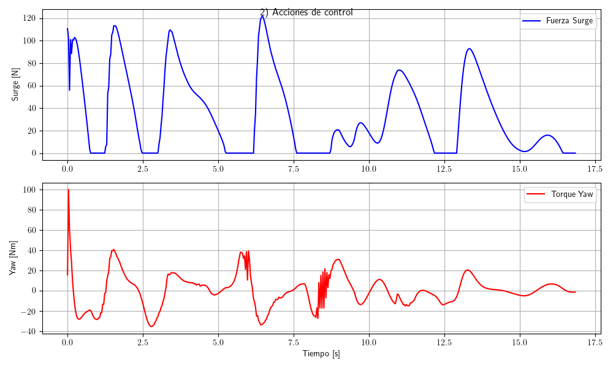
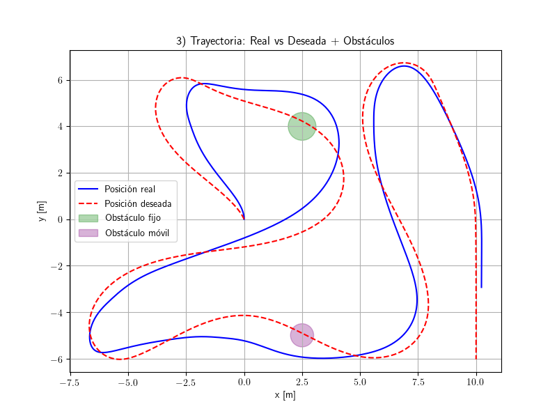
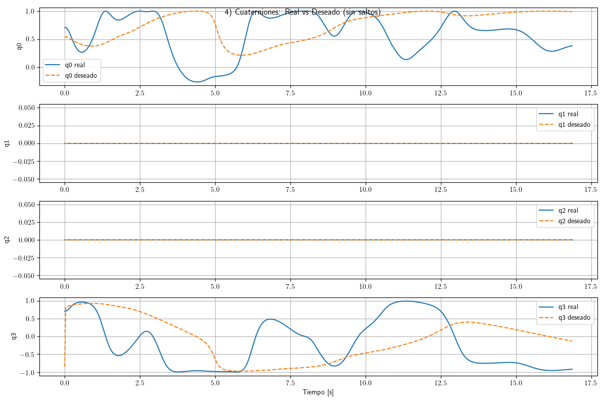
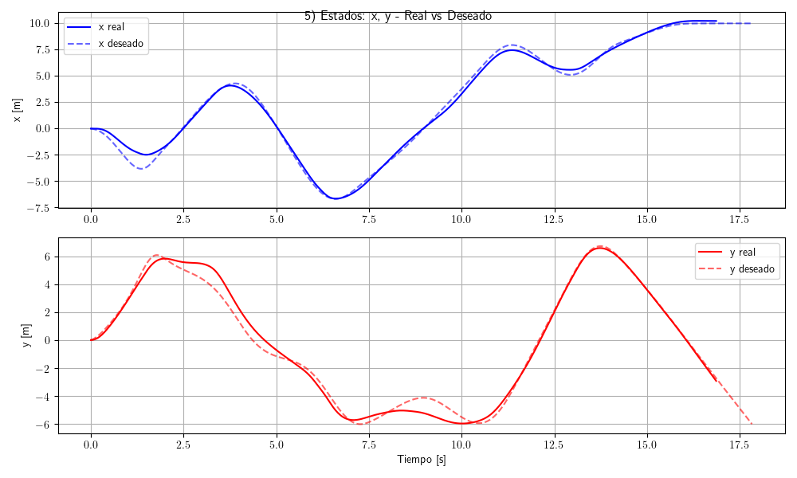
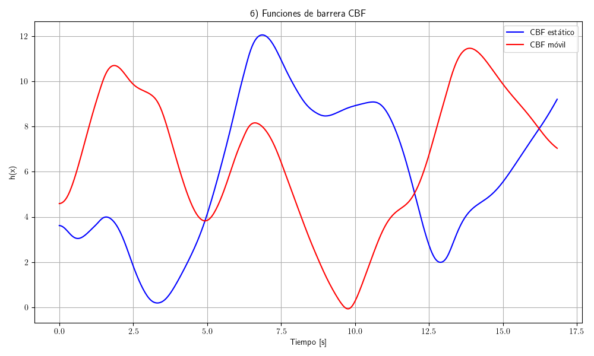
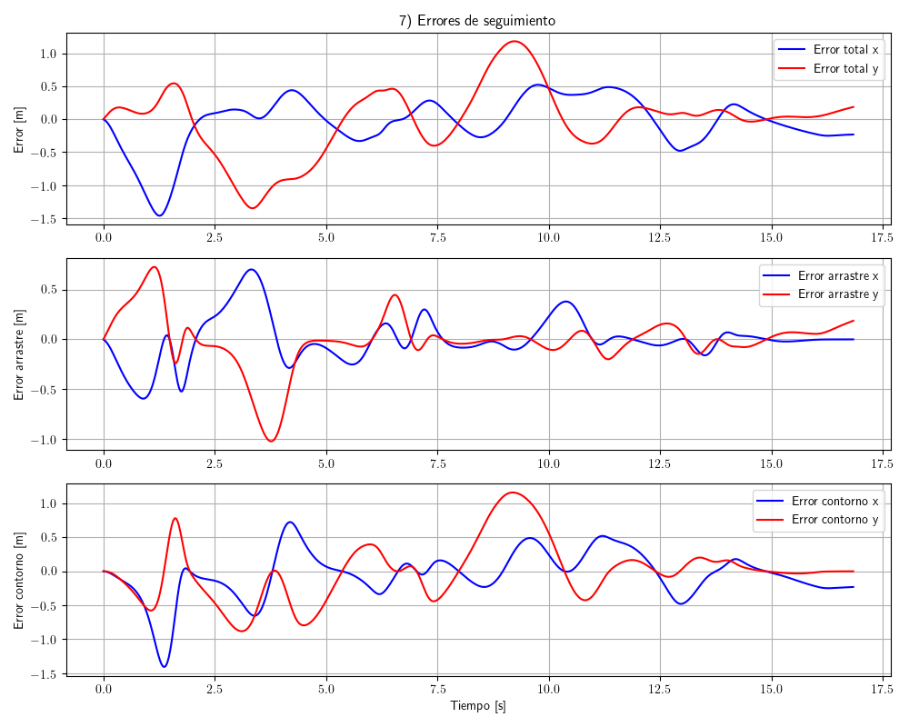
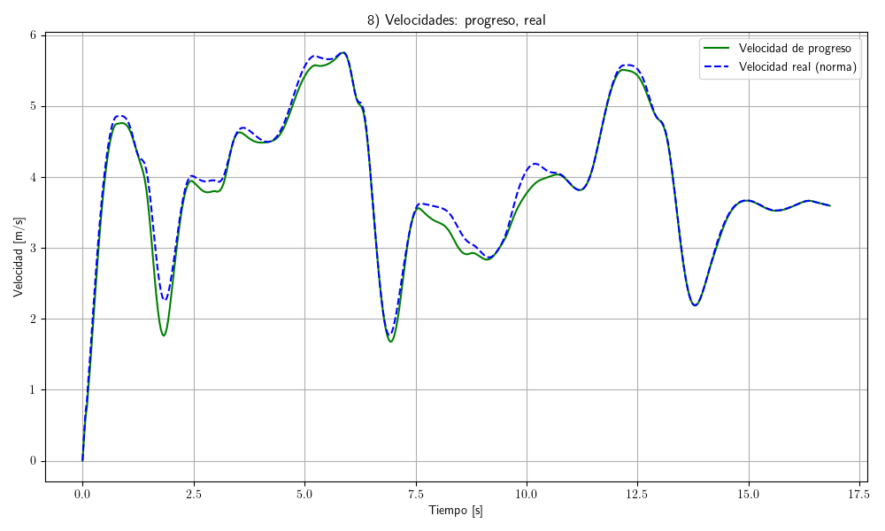

# 🚤 Proyecto de Control Predictivo con Restricciones CLF-CBF para un USV

Este repositorio contiene el código, resultados y animaciones de un **controlador predictivo basado en MPC con funciones de Lyapunov (CLF) y barreras (CBF)** aplicado a un vehículo de superficie autónomo (USV).  

El objetivo es **planificar y seguir trayectorias óptimas evitando obstáculos estáticos y móviles**.  

## ▶️ Animación

El video de la simulación está disponible en el repositorio:  

---

## 📂 Contenido del repositorio

- **Programa principal**  
  - `MPCC_SUV_quat.py` → Script central donde se define el modelo dinámico, se resuelve el OCP y se generan todas las gráficas y resultados.

- **Archivos de datos**  
  - `Results_MPCC_USV1.mat` → Resultados completos del experimento MPC+CLF+CBF.  
  - `Results_PathPlanning1.mat` → Resultados del path planning.  
  - `xref_optimo.npy`, `tref_optimo.npy` → Trayectoria óptima en NumPy.

- **Resultados gráficos**  
  - `0_path_planning.png` … `8_velocidades.png` → Cada gráfica del experimento.  
  - `control_actions.png`, `states.png`, etc. → Otras visualizaciones complementarias.

- **Animación**  
  - `animation_MPCC_SUV.mp4` → Video de la simulación del USV siguiendo la trayectoria.

---

## 📊 Gráficas principales (0–8)

A continuación se describen y muestran directamente las gráficas numeradas generadas en el experimento:

### `0_path_planning.png` – Path Planning
  
Trayectoria de **path planning** con waypoints y orientación deseada.  

---

### `1_velocidades.png` – Velocidades en cuerpo
  
Velocidades del USV en el marco de cuerpo: surge (u), sway (v), yaw rate (r).  

---

### `2_controles.png` – Acciones de control
  
Fuerza en surge y torque en yaw aplicados por el controlador.  

---

### `3_trayectoria.png` – Trayectoria
  
Comparación entre la **trayectoria real** y la **trayectoria deseada**, incluyendo obstáculos.  

---

### `4_quat_comparacion.png` – Orientación (cuaterniones)
  
Comparación de los cuaterniones reales vs deseados (q0, q1, q2, q3).  

---

### `5_xy_vs_ref.png` – Posiciones
  
x e y reales comparados con los deseados.  

---

### `6_CBF.png` – Funciones de barrera
  
Evolución de las **funciones de barrera CBF** que garantizan distancia a obstáculos.  

---

### `7_errores.png` – Errores de seguimiento
  
Errores de arrastre (lag), contorno (cross-track) y total.  

---

### `8_velocidades.png` – Velocidad de progreso
  
Velocidad de progreso del USV vs referencia.  

---

---

## 📁 Archivos de datos (`.mat`)

### `Results_MPCC_USV1.mat`
Resultados del **experimento completo con MPC+CLF+CBF**:  
- `states`: estados del USV.  
- `T_control`: entradas de control.  
- `CBF_1`, `CBF_2`: funciones de barrera.  
- `time`: vector de tiempo.  
- `ref`: referencia.  
- `e_total`, `e_contorno`, `e_arrastre`: errores.  
- `vel_progres`, `vel_progres_ref`: velocidades de progreso.  
- `posiciones`: posiciones de obstáculos.  

### `Results_PathPlanning1.mat`
Resultados del **path planning**:  
- Trayectoria interpolada.  
- Velocidades y aceleraciones.  
- Orientaciones.  
- Waypoints iniciales.  

---

## 📌 Nota para MATLAB

El **script principal es `MPCC_SUV_quat.py`**.  
Al final del archivo puedes ver cómo se generan estas gráficas.  
Para replicarlas en MATLAB:  

1. Cargar `Results_MPCC_USV1.mat` y `Results_PathPlanning1.mat`.  
2. Usar los datos para reproducir las gráficas **0–8**.  
3. Confirmar que coinciden con las imágenes guardadas en el repo.  

# MPCC_ASV
